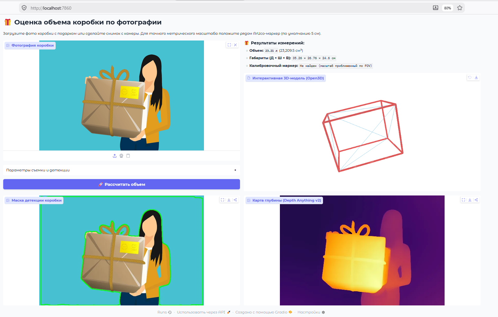
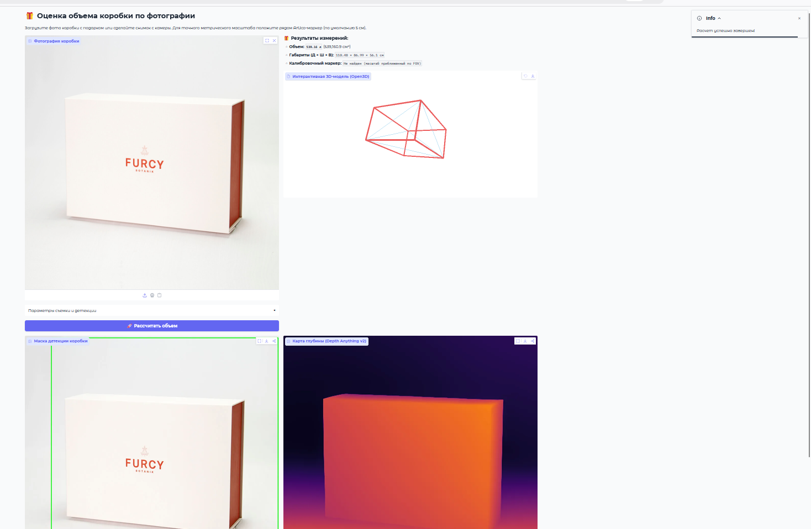
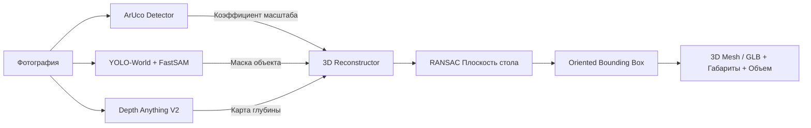

# 🎁 Box Volume Estimator (3D AI Measurement)

[](https://www.python.org/downloads/)
[](http://www.open3d.org/)
[](https://gradio.app/)
[](https://github.com/ultralytics/ultralytics)
[](https://huggingface.co/depth-anything)

Интеллектуальная система бесконтактной оценки 3D-габаритов и объема коробок/подарков по одной фотографии с использованием современных нейросетей компьютерного зрения (**YOLO-World**, **FastSAM**, **Depth Anything V2**) и методов 3D-геометрии (**Open3D**, **RANSAC**, **Oriented Bounding Box**).

---

## 📸 Интерфейс и демонстрация работы

<div align="center">
  
  <p><i>Интерактивная 3D-реконструкция подарочной коробки с выделением контура и карты глубины</i></p>
</div>

<div align="center">
  
  <p><i>Расчет объема и отображение полигонального каркаса OBB для коробки на столе</i></p>
</div>

---

## 🚀 Основные возможности

* **🔍 Open-Vocabulary детекция и точная сегментация**:
  * Комбинация **YOLO-World** (текстовый поиск по ключевым словам `box`, `gift box`, `package` и др.) и **FastSAM** для получения пиксельно-точных контуров объектов.
  * Интеллектуальный fallback при нестандартных ракурсах или слабом освещении.
* **🌐 Монокулярная оценка карты глубины (AI)**:
  * Использование предобученной модели **Depth Anything V2** (`Depth-Anything-V2-Small-hf`) для генерации непрерывной и детализированной карты относительных глубин.
* **📏 Точная калибровка масштаба**:
  * **ArUco-маркер**: при наличии маркера в кадре (по умолчанию 5 см) масштаб и глубина калибруются с точностью до миллиметров.
  * **FOV-калибровка**: при отсутствии маркера расчет выполняется на основе угла обзора камеры (Field of View).
* **📐 3D-реконструкция и RANSAC-анализ плоскости**:
  * Восстановление 3D-облака точек в метрических координатах.
  * Алгоритм **RANSAC** для обнаружения опорной плоскости (стола/пола) и достройки невидимого основания коробки.
  * Расчет минимального ориентированного ограничивающего параллелепипеда (**Oriented Bounding Box, OBB**), длины, ширины, высоты и объема в литрах / см³.
* **🎮 Интерактивный Web-интерфейс на Gradio**:
  * Встроенный 3D-вьювер (**Three.js / GLB**) для вращения, масштабирования и осмотра полигональной 3D-модели и объемных ребер OBB.
  * Пошаговый индикатор прогресса инференса и всплывающие подсказки.
  * Настройка физического размера маркера, угла обзора камеры (FOV) и порога уверенности детекции (Confidence).

---

## 🛠️ Архитектура пайплайна



---

## 📦 Установка и запуск

### 1. Клонирование репозитория

```bash
git clone https://github.com/SolomonJSX/BOX-VOLUME-ESTIMATOR.git
cd BOX-VOLUME-ESTIMATOR/box-volume-estimator
```

### 2. Установка зависимостей через `uv` (рекомендуется)

Проект оптимизирован для работы с пакетным менеджером [uv](https://docs.astral.sh/uv/):

```bash
# Установка и запуск виртуального окружения
uv sync
```

*Или классическая установка через `pip`:*
```bash
python -m venv .venv
# Активация окружения (Windows):
.venv\Scripts\activate
# Активация окружения (Linux/macOS):
source .venv/bin/activate

pip install -r pyproject.toml
```

### 3. Запуск веб-приложения (Gradio UI)

```bash
uv run python src/app.py
```

После запуска откройте в браузере: **`http://localhost:7860`**

### 4. Запуск через командную строку (CLI)

```bash
uv run python run.py path/to/your/box_image.jpg --viz
```

Параметр `--viz` открывает интерактивное нативное 3D-окно Open3D.

---

## 🧪 Запуск тестов

Проект покрыт автоматическими модульными и интеграционными тестами (Pytest):

```bash
# Запуск всех тестов
uv run pytest -v

# Запуск только модульных тестов геометрии и детекции
uv run pytest tests/test_geometry.py tests/test_detection.py -k "Unit" -v
```

---

## 📂 Структура проекта

```text
BOX-VOLUME-ESTIMATOR/
├── assets/
│   └── Screens/                  # Скриншоты работы приложения
├── data/
│   ├── raw/                      # Исходные тестовые фото
│   └── processed/                # Сгенерированные 3D-модели (.glb, .obj, .ply) и маски
├── src/
│   ├── config.py                 # Настройки проекта и гиперпараметры моделей
│   ├── app.py                    # Веб-интерфейс на Gradio 6
│   ├── depth/
│   │   └── depth_estimator.py    # Инференс Depth Anything V2
│   ├── detection/
│   │   ├── detector.py           # Детектор коробки (YOLO-World + FastSAM)
│   │   └── marker.py             # Детектор маркеров ArUco (OpenCV)
│   ├── geometry/
│   │   └── reconstructor.py      # 3D-реконструкция, RANSAC стола, расчет OBB и сетки
│   └── utils/
│       └── visualizer.py         # Экспорт 3D GLB/OBJ/PLY и отладочных наложений
├── tests/
│   ├── test_detection.py         # Тесты модуля детекции
│   └── test_geometry.py          # Тесты 3D-геометрии и объема
├── run.py                        # CLI интерфейс (Typer + Rich)
├── pyproject.toml                # Конфигурация проекта и зависимости
└── README.md
```

---

## 💡 Советы для наилучшей точности

1. **Освещение**: избегайте сильных бликов и глубоких теней.
2. **Ракурс**: наилучшая оценка объема достигается при съемке под углом ~30–45° сверху, когда видны 2–3 грани коробки.
3. **Калибровочный маркер**: для точного замера в сантиметрах распечатайте стандартный маркер **ArUco Dict 5x5_100** (5×5 см) и положите рядом с объектом.
4. **Порог уверенности (Confidence)**: если коробка имеет сложный узор или надписи, уменьшите слайдер *Confidence* в блоке параметров до `0.10–0.15`.

---

## 📄 Лицензия

Проект распространяется под лицензией MIT. Подробности в файле [LICENSE](LICENSE).